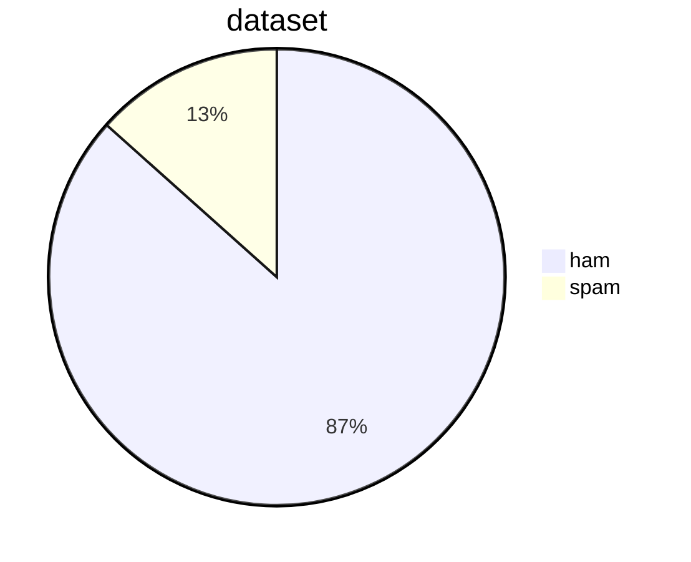

# NYCU-2023Spring-Introduction_to_AI-final_project
## Ham or Spam email type prediction.
### Introduction
Spam emails in your inbox would be annoying since it disturbs the routine. That is why our email accounts already have got a spam filter. In addition, it would be interesting to know about how it is developed and different ways of filtering methods so as to filter spam emails more efficiently and effectively.  

### Related work
#### 1. sentiment analysis
Sentiment analysis (or opinion mining) is a natural language processing (NLP) technique used to determine whether data is positive, negative or neutral. Sentiment analysis is often performed on textual data to help businesses monitor brand and product sentiment in customer feedback, and understand customer needs.    
#### 2. mail type predictor  
Most emails nowadays are generated using a fixed template by machines,such messages include shopping receipts, promotional campaigns, newsletters, booking confirmations, etc. With this convenient technique,it's even more easy for someone to send spam(trash) emails with bad intention.  
In this project,we want to simulate the mail type classifier to predict the mail is ham(good) or spam(bad).  
The difference b/t our project and most existing ones is that we don't use the state of the art models like XGBoost,we compare the difference b/t the most fundamental language model ngram,ngram w/different feature selection method called chi suqare,and a advanced technique called BERT.  

### Dataset/Platform
I am using Spambase dataset from [this kaggle](https://www.kaggle.com/datasets/nittalasatyasrinivas/smsspamcollectiontsv) and split them into 2 manually for training and testing.  
The distribution of dataset are presented below.  

### Baseline
